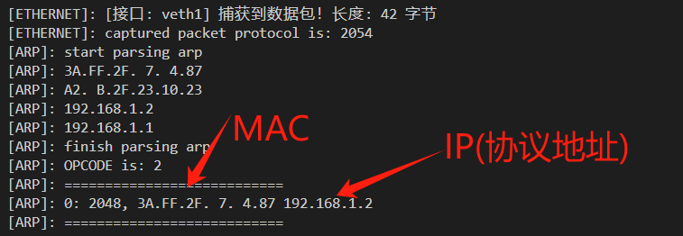
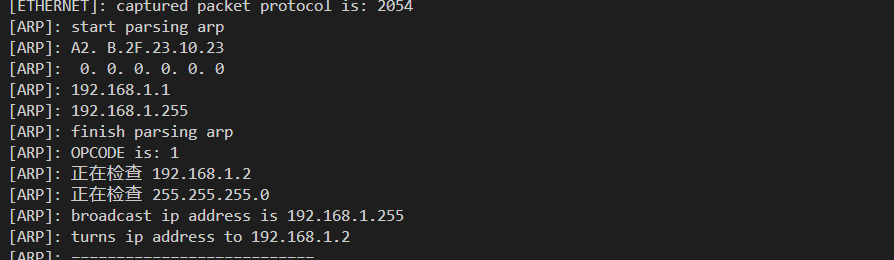

## How to use

compile and run a router

```shell
mkdir build & cd build
cmake ..
make
sudo ./myRouter
```

本路由器只需要一个支持pcap的物理接口收发frame即可运行

目前支持Ethernet ARP IPV4 ICMP UDP


## 测试

### 1. ARP协议




LOG中，可以清晰的看到正确打印出ARP的发送源与目的地址，以及正确的OPCODE（REQUEST & REPLY）

您可能同时也注意到，REQUEST中目的物理地址也被正确的设置为全0(0.0.0.0.0.0)